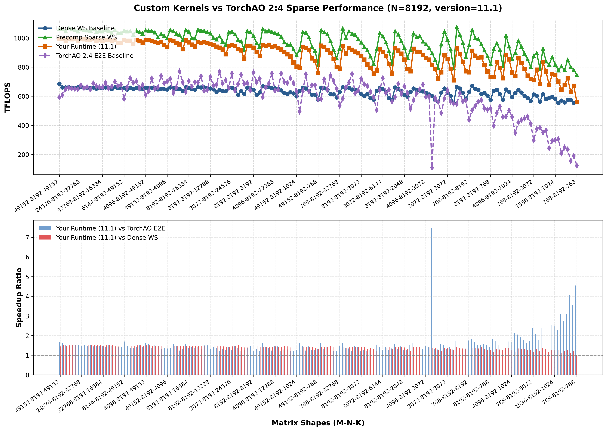
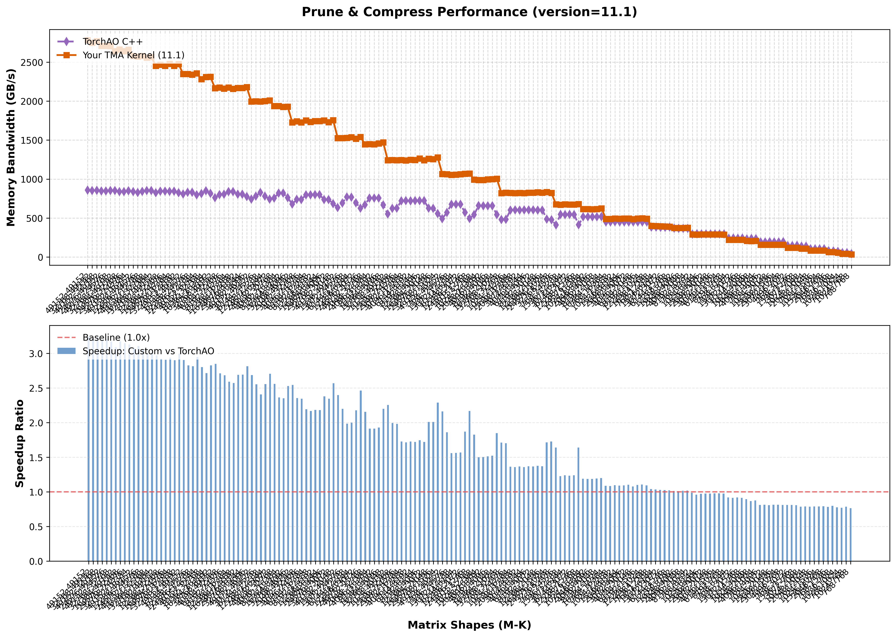
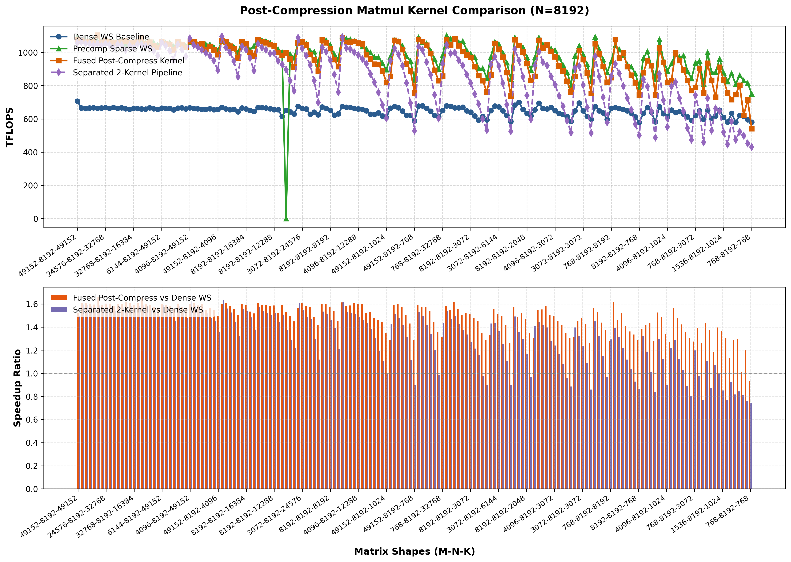
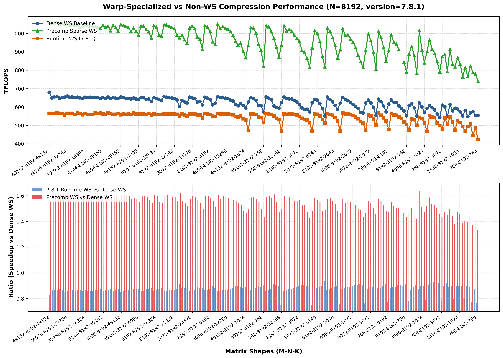
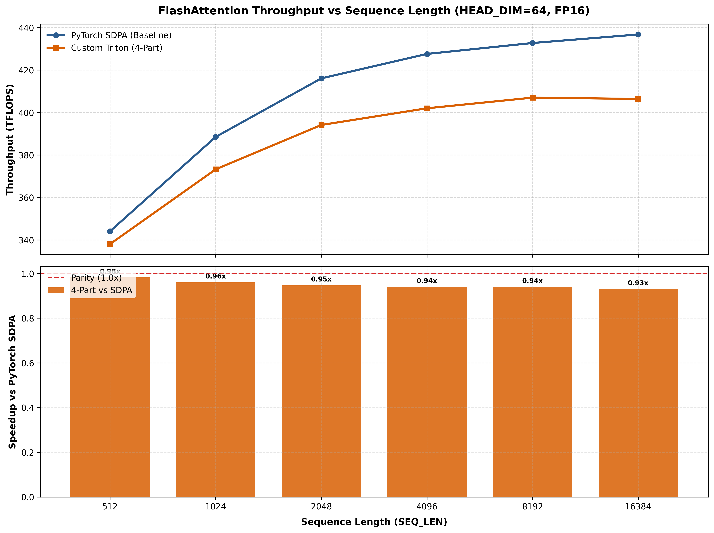
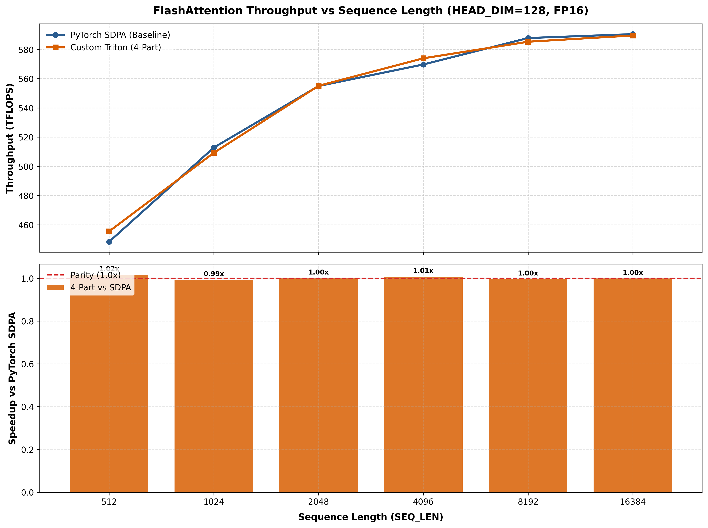
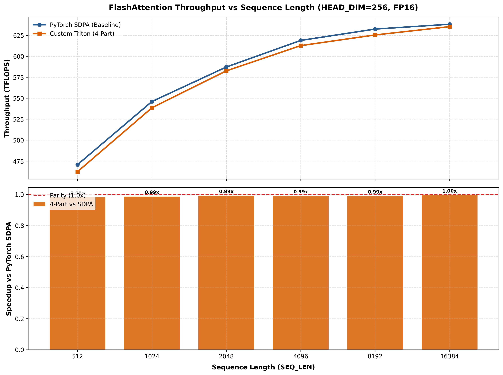

# GPU Sparse Kernel Research

GPU kernels for **2:4 structured sparse matrix multiplication** and **sparse attention** on NVIDIA Hopper (H100), written with [Triton](https://github.com/triton-lang/triton) and [Gluon](https://github.com/triton-lang/triton/tree/main/python/triton/experimental/gluon) (Triton's experimental low-level API for warp specialization, TMA, and explicit shared memory management).

## Key Results — Sparse MatMul
All benchmarks run on NVIDIA H100 SXM 80GB, measured over 169 matrix shapes ($N = 8192$, varying $M, K$). Throughput numbers below reflect the **peak sustained throughput on large, compute-bound shapes** ($M, K \ge 8192$).
### v11.1 — Two-Kernel Approach (Prune+Compress → Sparse MatMul)
Separates pruning/compression into a standalone kernel, then feeds into the existing sparse WGMMA matmul.
| Metric | Peak Sustained ($M,K \ge 8\text{k}$) | Comparison |
|--------|--------------------------------------|------------|
| **E2E throughput** | ~990 TFLOPS | **1.5× dense WS** (~660 TFLOPS) / **~93% of sparse WS** (~1064 TFLOPS, only ~7% overhead) |
| **Standalone prune+compress** | ~2750 GB/s | **3.2× TorchAO** CuSparselt (~855 GB/s) / **~82% of H100 theoretical peak** (3.35 TB/s) |
- Kernel: [`compression/kernels/11.1_2_kernel_baseline.py`](compression/kernels/11.1_2_kernel_baseline.py)
- E2E results: [`compression/results/logs/11.1_N=8192_750942.out`](compression/results/logs/11.1_N=8192_750942.out)

- Pruning results: [`compression/results/logs/11.1_pruning_723267.out`](compression/results/logs/11.1_pruning_723267.out)

### v10.1 — Fused Output Pruning+Compression
Fuses 2:4 pruning and metadata generation directly into the matmul accumulator writeback. Near-zero overhead compared to the pre-computed sparse baseline.
| Metric | Peak Sustained ($M,K \ge 8\text{k}$) | Comparison |
|--------|--------------------------------------|------------|
| **E2E throughput** | ~1060 TFLOPS | **~99% of precomp sparse** (~1070 TFLOPS) / **> 2-kernel** (~990–1050 TFLOPS) |
- Kernel: [`compression/kernels/10.1_prune_acc.py`](compression/kernels/10.1_prune_acc.py)
- Results: [`compression/results/logs/10.1_N=8192_815845.out`](compression/results/logs/10.1_N=8192_815845.out)



### v7.8.1 — Input Pruning (Negative Result)

Prunes + compresses input tiles before the matmul. The compression overhead dominates — throughput drops to ~565 TFLOPS, **worse than dense** (~660 TFLOPS).

- Kernel: [`compression/kernels/7.8.1_prune_ws.py`](compression/kernels/7.8.1_prune_ws.py)
- Results: [`compression/results/7.8.1_N=8192_694903.out`](compression/results/7.8.1_N=8192_694903.out)



## Key Results — Sparse Attention 

### Dense FlashAttention-3
Custom 4-Part FlashAttention-3 kernel implementation achieving near-native parity with PyTorch SDPA across standard Transformer head dimensions ($D \in \{64, 128, 256\}$) and sequence lengths up to $16\text{k}$.

- Kernel: [`attention/kernels/gluon_attention_pingpong_overlap.py`](attention/kernels/gluon_attention_pingpong_overlap.py)
- Results: [`attention/results/logs/FA3_baseline_820247`](attention/results/logs/FA3_baseline_820247.out)

| Head Dim ($D$) | Peak Sustained ($N \ge 8\text{k}$) | Parity vs. PyTorch SDPA | Key Highlight |
|---|---|---|---|
| **$D = 64$** | **~420 TFLOPS** | **~94% – 101%** | Outperforms SDPA at $N=512$ (348 vs. 346 TFLOPS) |
| **$D = 128$** | **~588 TFLOPS** | **~98% – 103%** | Outperforms SDPA up to $N=1024$ (525 vs. 519 TFLOPS) |
| **$D = 256$** | **~641 TFLOPS** | **~99% – 101%** | Maintains ~99% throughput scaling across long contexts ($16\text{k}$) |






## Directory Layout

```
.
├── compression/              # 2:4 sparse matmul kernels
│   ├── kernels/              #   landmark / milestone kernels
│   ├── dev/                  #   development history (v1–v9, benchmarks, profiling)
│   ├── results/              #   .out benchmark logs + plots
│   ├── common.py             #   shared WGMMA helpers & tile scheduler
│   ├── gluon_ws_sparse.py    #   warp-specialized sparse matmul (imported by v11)
│   ├── gluon_ws_dense.py     #   warp-specialized dense matmul baseline
│   ├── prune.py              #   2:4 pruning reference impl
│   ├── compress_2_4.py       #   dense→sparse conversion
│   └── sbatch_sh/            #   Slurm job scripts
│
├── attention/                # FlashAttention-style kernels (WIP)
│   ├── kernels/              #   active attention kernels
│   ├── dev/                  #   experimental variants
│   ├── results/              #   benchmark outputs + plots
│   ├── common.py             #   → symlink to compression/common.py
│   └── sbatch_sh/            #   Slurm job scripts
│
├── gluon_spmm/               # (gitignored) packaged sparse matmul library
├── note/                     # dated research notes
└── practice/                 # learning / scratch experiments
```

## Running

Kernels run inside an Apptainer/Singularity container with PyTorch + CUDA 12.x and a custom Triton library with sparse WGMMA operation:

```bash
# Interactive
apptainer exec --nvccli sparse.sif python compression/kernels/11.1_2_kernel_baseline.py

# Via Slurm
sbatch compression/sbatch_sh/trillium/11.1_benchmark.sh
```

## Hardware

- **GPU**: NVIDIA H100 SXM 80GB (Hopper, sm_90a)
- **Key features used**: TMA (Tensor Memory Accelerator), WGMMA (Warp-Group Matrix Multiply Accumulate), warp specialization, structured sparsity (2:4)

## Acknowledgements

- Sparse WGMMA operations in Triton/Gluon used throughout this project rely on a custom sparse WGMMA implementation developed by my mentor in **stoicc** (not publicly available).
